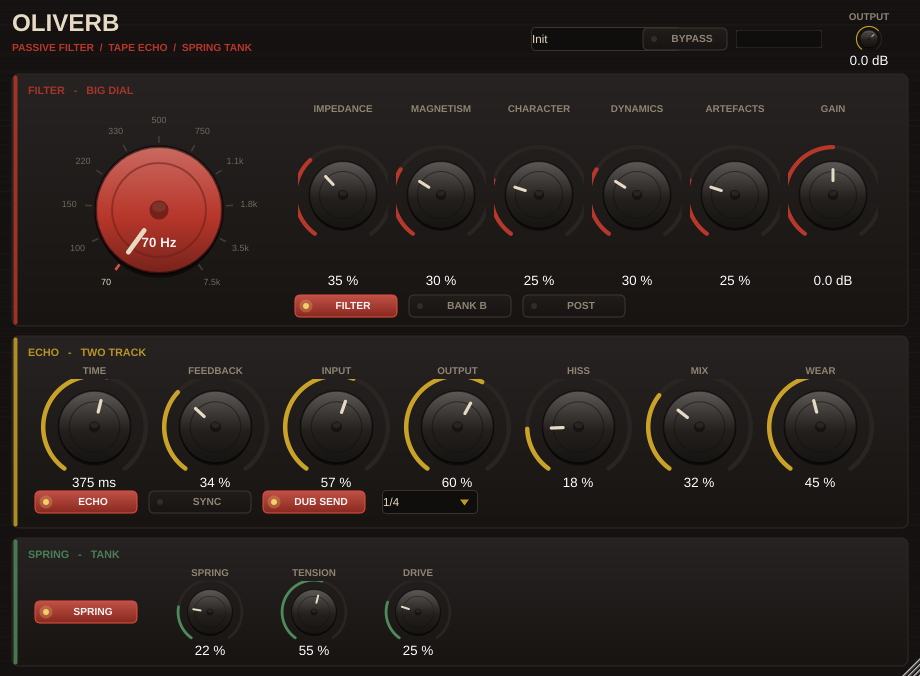

# OLIVERB

**A passive high-pass filter, a two-track tape echo, and a spring tank — the three boxes that made dub.**

VST3 / AU / Standalone. macOS, Windows, Linux. C++17 + JUCE 8.

**[User manual](docs/MANUAL.md)** — installation, every control, presets, dub techniques.



---

## What this is

The AudioThing *Alborosie Dub Station* is gone and isn't coming back. This is not that
plug-in, and it isn't a copy of it: nothing was decompiled, and none of its code, graphics,
presets, or measurements are here. What both plug-ins have in common is their *subject* —
three well-documented pieces of 1960s hardware:

| Section | Modelled on |
|---|---|
| **Filter** | A passive, inductor-based, stepped variable high-pass filter of the Altec 9069B type — the "Big Knob" bolted to the top right of King Tubby's MCI desk |
| **Echo** | A 2-track studio recorder used as an echo, with the output patched back to the input |
| **Spring** | A two-tank spring reverb, run hotter than its designer intended |

Circuit topologies and the physics of a saturating inductor aren't anyone's property. This
repository is an independent implementation of them, from scratch, MIT licensed. The
frequency tables are a plausible reconstruction of an eleven-position 70 Hz – 7.5 kHz
switch, not measurements of a specific unit.

---

## Getting binaries without building anything

Every push to `main` builds installable plug-ins for all three platforms via GitHub Actions.

1. Push this repo to GitHub (see below).
2. Open the **Actions** tab → click the newest run → wait for the green ticks.
3. Download **OLIVERB-macOS** / **OLIVERB-Windows** / **OLIVERB-Linux** from the
   *Artifacts* box at the bottom of the run.

Install by dropping the `.vst3` (and `.component` on macOS) into:

- macOS: `~/Library/Audio/Plug-Ins/VST3/` and `~/Library/Audio/Plug-Ins/Components/`
- Windows: `C:\Program Files\Common Files\VST3\`

macOS will refuse to open an unsigned plug-in the first time. Right-click → Open, or run
`xattr -dr com.apple.quarantine /path/to/Oliverb.vst3`.

Tag a commit `v1.0.0` and the same workflow publishes a GitHub Release with the zips attached.

---

## Building locally

You need CMake 3.22+ and a compiler: Xcode on macOS, Visual Studio 2022 on Windows.
JUCE downloads itself on first configure — nothing else to install.

```bash
cmake -B build -DCMAKE_BUILD_TYPE=Release
cmake --build build --config Release --parallel
```

The plug-in installs itself into your system plug-in folder after each build
(`-DWH_COPY_PLUGIN=OFF` to stop that). Already have JUCE on disk?
`-DWH_JUCE_PATH=/path/to/JUCE` and it skips the download.

Verify the DSP without opening a DAW:

```bash
cmake --build build --target dsp_test && ./build/dsp_test
```

That runs the filter, echo, and spring through measured checks — filter slope, corner
peaking, stability under abuse, echo self-oscillation, spring decay — and prints a pass/fail
table. Run it after any DSP edit; it catches an unstable feedback loop in one second instead
of in your monitors.

---

## The controls

### Filter — Big Dial

| Control | What it does |
|---|---|
| **Frequency** | Eleven switch positions, 70 Hz – 7.5 kHz. 18 dB/octave. |
| **Type (Bank A / B)** | Two capacitor banks. A is the classic broad sweep; B sits lower and tighter. |
| **Impedance** | Termination. Terminated = flat. Open = several dB of lift right at the corner. This is the sound. |
| **Magnetism** | How hard the inductor core saturates. Level pushes the corner upward and generates harmonics. |
| **Character** | Non-linearity in the network's damping path — harmonic content, independent of the core. |
| **Dynamics** | How fast the core tracks the signal. Slow = a gentle breathing lift. Fast = it behaves like an envelope filter. |
| **Artefacts** | Switch thump. At 0 the corner glides between positions (the hardware can't). At 1 it clacks like the real rotary. |
| **Gain** | Internal trim, ±18 dB. |
| **Pre / Post** | **Pre**: the filter feeds the echo, so repeats inherit the dial and sweeping drags the tail with it. **Post**: the filter sits across the finished signal, echo tails included. Two different instruments. |

### Echo — Two Track

Time (or Sync + note division), Feedback, Input, Output, Hiss, Mix, and **Wear**.

Feedback goes past unity on purpose: it self-oscillates and then limits into the record
amp rather than exploding. **Dub Send** cuts the feed *into* the machine while the loop
keeps running — throw a snare in, close the door behind it. Changing Time drags the
transport, so it bends pitch on the way, as tape does. Hiss is recorded to tape, so it
builds with the feedback instead of sitting on top.

### Mod — LFO / Envelope

Both sources push the **frequency dial**, in octaves relative to the switch position, so
everything the filter does — the corner peak, the core saturation, the character — rides
along with the sweep.

- **LFO**: five shapes (sine, triangle, saw down, square, sample-and-hold), free-running
  0.02–20 Hz or synced to the host with note divisions. Synced sweeps re-align to the bar.
- **Envelope**: follows the *input* signal. `Sens` sets how hard it listens, `Speed` sets
  how fast it moves, and `Env Depth` is bipolar — positive opens the filter on hits
  (auto-wah), negative ducks it.

### Spring — Tank

Spring (amount), Tension (decay), Drive (into the send transducer, where the crash lives).

---

## Where things live

```
Source/
  dsp/Utils.h              primitives: delay line, allpass, SVF, envelopes, saturation
  dsp/PassiveHighPass.h    the filter — start here
  dsp/TapeEcho.h           the echo
  dsp/SpringReverb.h       the tank
  Parameters.h             every parameter's ID, range, default, and display format
  PluginProcessor.cpp      routing, oversampling, presets
  PluginEditor.cpp         layout and painting
  LookAndFeel.cpp          the faceplate
Tests/dsp_test.cpp         the DSP checks
docs/DESIGN.md             how each model works and what to change to change the sound
```

Everything in `Source/dsp/` is plain C++ with no JUCE in it — which is why the test harness
can build in a second, and why the models can be lifted into another project as-is.

---

## Ideas worth doing next

- MIDI-learn on the big dial, so it can be swept from a fader
- Ducking on the echo send, the standard modern dub move
- A second spring tank voicing (short/bright vs long/dark)
- Preset save/load to disk, and factory preset banks

---

MIT licensed. King Tubby's name and the names of any commercial product are used here only
to describe what the hardware is; no affiliation or endorsement is claimed or implied.
