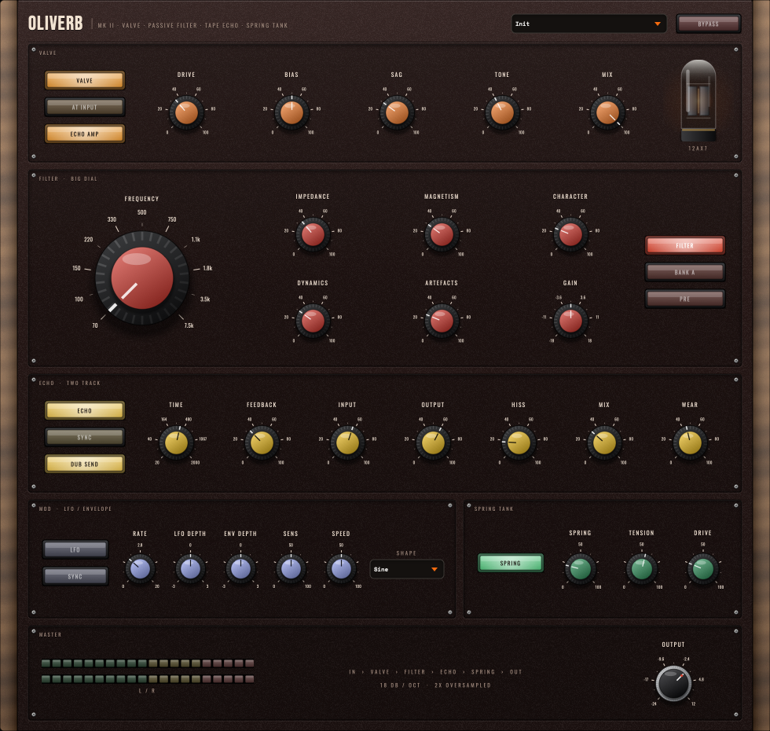

# OLIVERB MK II — User Manual

*Version 2.1.0 — Studio Series faceplate*  
Printable versions: [OLIVERB-Manual.pdf](OLIVERB-Manual.pdf) · one-page [OLIVERB-QuickGuide.pdf](OLIVERB-QuickGuide.pdf)

OLIVERB is four pieces of 1960s dub hardware in one plug-in: a valve preamp, a passive
inductor-based high-pass filter (the "Big Knob" of King Tubby's mixing desk), a two-track
tape machine patched into itself as an echo, and a spring reverb tank driven harder than
its designer intended. Use one section or all four — each has its own on/off switch.

**New in MK II:** the **Valve** section — a triode preamp with bias, supply sag and an
output transformer, for real even-harmonic tube saturation. Put it at the front of the
chain or the back, and let the same valve drive the tape machine's record amp.

**New in 2.1.0:** the Deestech **Studio Series** faceplate — same sound, same parameters,
sessions reload exactly as saved.

**Formats:** VST3, AU, Standalone · **Platforms:** macOS (universal), Windows, Linux · **License:** MIT

---

## The faceplate



An oxblood panel between walnut cheeks, with six modules stacked in signal order. Each is
keyed by the colour of its knob caps and lamp buttons:

| Module | What lives there |
|---|---|
| **Header** | Preset menu, **Bypass**, and the UPDATE pill when a new version is out |
| **Valve** (amber) | Valve / At Input·At Output / Echo Amp lamps; Drive, Bias, Sag, Tone, Mix; the glowing 12AX7 |
| **Filter · Big Dial** (red) | The big Frequency dial (its scale shows the chosen bank's eleven corners); Impedance, Magnetism, Character, Dynamics, Artefacts, Gain; Filter / Bank A·B / Pre·Post lamps |
| **Echo · Two Track** (gold) | Echo / Sync / Dub Send lamps; Time, Feedback, Input, Output, Hiss, Mix, Wear |
| **Mod · LFO / Envelope** (lilac) | LFO / Sync lamps; Rate, LFO Depth, Env Depth, Sens, Speed; Shape menu |
| **Spring Tank** (green) | Spring lamp; Spring, Tension, Drive |
| **Master** | L/R peak meters, the live signal-chain readout, the Output knob |

Two-way lamps name their current state (e.g. **AT INPUT** dark, **AT OUTPUT** lit). With
**Sync** lit, the echo's Time knob and the LFO's Rate knob become note-division menus. Hover,
drag or scroll a knob to see its exact value.

**Resizing:** drag the bottom-right corner to scale the window from 60 % to 150 % of its
980 × 930 base size; everything is vector-drawn and stays sharp.

**Update notices:** while its window is open, OLIVERB checks deestechholdings.com/updates.json
at most once a day. If a newer version exists, an amber **UPDATE x.y.z** pill appears in the
header, left of the preset menu — click it for the notes, DOWNLOAD, or SKIP THIS VERSION.

---

## 1. Installation

### macOS

Download `OLIVERB-macOS.zip` from the
[Releases page](https://github.com/damielolar-CODE/oliverb/releases), unzip it, and run
**`OLIVERB-macOS.pkg`**. It installs the VST3 and AU for all users:

- `/Library/Audio/Plug-Ins/VST3/OLIVERB.vst3`
- `/Library/Audio/Plug-Ins/Components/OLIVERB.component`

The installer is unsigned, so the first launch may be blocked. Right-click the `.pkg` →
**Open** → **Open** anyway. If the plug-in itself is quarantined:

```
xattr -dr com.apple.quarantine /Library/Audio/Plug-Ins/VST3/OLIVERB.vst3
```

Prefer a manual install? The zip also contains the raw `OLIVERB.vst3` and
`OLIVERB.component` — drop them into `~/Library/Audio/Plug-Ins/VST3/` and
`~/Library/Audio/Plug-Ins/Components/`.

### Windows

Download `OLIVERB-Windows.zip`, unzip, and run **`OLIVERB-Windows-Setup.exe`**. It
installs to `C:\Program Files\Common Files\VST3\OLIVERB.vst3`. SmartScreen will warn
about an unrecognised app: click **More info → Run anyway**. Manual install: copy the
`OLIVERB.vst3` folder from the zip into `C:\Program Files\Common Files\VST3\`.

### Linux

Download `OLIVERB-Linux.zip` and copy `OLIVERB.vst3` to `~/.vst3/`.

After installing on any platform, rescan plug-ins in your DAW. OLIVERB appears under
**Deestech** in the Fx / Filter / Delay / Reverb categories. Upgrading: install over the top.

---

## 2. First sound in sixty seconds

1. Insert OLIVERB on a drum loop or a full mix.
2. Open the preset menu and pick **Waterhouse Rockers**. That's the classic chain:
   valve into filter into echo into spring.
3. Turn the valve **Drive** up and watch the 12AX7 glow: the sound thickens and compresses
   but doesn't get louder. That's the tube.
4. Grab the big **Frequency** dial and sweep it up and back down. The corner peak,
   the switch clacks and the way the echo tail follows the dial — that's the plug-in.
5. Turn **Feedback** up past 80 % and tap **Dub Send** so it goes dark and reads *Held*:
   the input stops feeding the machine but the loop keeps regenerating. That's a dub-out.
6. Tap it back to *Dub Send* and carry on.

---

## 3. Signal flow

```
                        ┌───────────  PRE (default)  ───────────┐
   input ──► VALVE ──►  FILTER  ──►  ECHO  ──►  SPRING  ──►  OUTPUT
             (input)    └── or POST: ECHO ──► SPRING ──► FILTER ─┘
                                                   └─► VALVE (output) ─┘
```

The **Valve** sits at the front by default (*At Input*), colouring everything
that follows; light *At Output* and it becomes a master valve stage across the whole
mix, echo tails and spring included. With **Echo Amp** lit, the tape machine's record
amplifier is also a valve, so repeats cook in the same flavour.

The filter's **Pre / Post** switch is the other big routing decision:

- **Pre** — the filter feeds the echo, so every repeat inherits the dial position, and
  sweeping the dial drags the echo tail with it. This is the performance position.
- **Post** — the filter sits across the finished signal, echo tails included. Use it
  to carve the whole wet mix at once.

The chain readout in the Master module always shows the current order.

Everything runs at 2× oversampling internally; the extra latency is reported to your
host automatically, so tracks stay aligned.

---

## 4. The Valve — Preamp

A single-ended triode line amplifier with an output transformer. Its transfer curve is
asymmetric — grid conduction flattens the positive swing quickly, cut-off softens the
negative swing slowly — which is why it produces even harmonics (warmth) rather than the
odd-only fuzz of a symmetric clipper. Level is compensated as you drive it, so the knob
changes the *shape* of the sound far more than the loudness.

| Control | Range (default) | What it does |
|---|---|---|
| **Drive** | 0–100 % (35 %) | Gain into the grid, up to +36 dB. Zero is a clean line amp (about 1 % second harmonic); full is a valve on its knees. |
| **Bias** | 0–100 % (50 %) | The operating point. Cold is near-symmetric and stays clean until pushed; hot is asymmetric from the first volt and thick at any level. |
| **Sag** | 0–100 % (30 %) | The supply giving way under load. Gain drops and bias goes colder as the signal rises: compression, bloom, and a stage that pushes back. |
| **Tone** | 0–100 % (40 %) | The output transformer. Iron bump below 100 Hz, loss at the very top (19 kHz down to 6.5 kHz), and the core rounding off what's still too big for it. |
| **Mix** | 0–100 % (100 %) | Parallel blend against the dry signal. |
| **At Input / At Output** | (At Input) | *At Input* puts the valve first in the chain; *At Output* (lit) puts it last, after the spring. |
| **Echo Amp** | (On) | Hands the same valve curve to the tape machine's record amplifier, scaled by Drive. Off restores the original solid-state record amp. |

The drawn **12AX7** at the right of the module glows with how hard the valve is actually working — a
useful thing to watch when Sag is doing its job.

---

## 5. The Filter — Big Dial

A passive, inductor-based high-pass, third order (18 dB/octave). No active parts — its
character comes from termination and core saturation, not resonance.

| Control | Range (default) | What it does |
|---|---|---|
| **Frequency** | steps 1–11 (1) | Eleven switch positions. See the table below. |
| **Bank A / Bank B** | A / B (A) | Capacitor bank. A is the classic broad sweep; B sits lower and tighter. |
| **Impedance** | 0–100 % (35 %) | Termination. At 0 % the network is properly terminated and flat; open it up and the corner lifts by several dB. This peak is the sound of the hardware. |
| **Magnetism** | 0–100 % (30 %) | How hard the inductor cores saturate. Signal level pushes the corner upward and generates harmonics. |
| **Character** | 0–100 % (25 %) | Non-linearity in the damping path — adds harmonic content (even and odd) independent of the core. |
| **Dynamics** | 0–100 % (30 %) | How fast the core tracks the signal. Slow = a gentle breathing lift; fast = it behaves like an envelope filter. |
| **Artefacts** | 0–100 % (25 %) | Switch thump. At 0 % the corner glides between positions (the hardware can't do this). At 100 % it clacks like the real rotary. |
| **Gain** | ±18 dB (0 dB) | Internal trim after the filter. |
| **Pre / Post** | (Pre) | Filter before the echo, or across the finished signal. See §3. |

### Switch positions

| Step | Bank A | Bank B |
|---|---|---|
| 1 | 70 Hz | 50 Hz |
| 2 | 100 Hz | 80 Hz |
| 3 | 150 Hz | 120 Hz |
| 4 | 220 Hz | 170 Hz |
| 5 | 330 Hz | 240 Hz |
| 6 | 500 Hz | 350 Hz |
| 7 | 750 Hz | 520 Hz |
| 8 | 1.1 kHz | 800 Hz |
| 9 | 1.8 kHz | 1.3 kHz |
| 10 | 3.5 kHz | 2.4 kHz |
| 11 | 7.5 kHz | 5.0 kHz |

---

## 6. The Echo — Two Track

A studio tape recorder used as an echo: record head → tape → replay head, output patched
back to the input. Each pass through the loop loses a little top end and gains a little
saturation, so long tails get darker and thicker rather than louder.

| Control | Range (default) | What it does |
|---|---|---|
| **Time** | 20–2000 ms (375 ms) | Tape delay. Changing it drags the transport, so pitch bends on the way — as tape does. |
| **Sync** | (Free) | Lock Time to the host tempo: the Time knob becomes a Division menu. |
| **Division** | 1/16 – 1/1 (1/4) | Note length when synced. Includes triplet (T) and dotted (.) values. |
| **Feedback** | 0–100 % (34 %) | Loop regeneration. Unity gain sits at 80 % — above that the machine self-oscillates on purpose, limiting into the record amp instead of exploding. |
| **Dub Send / Held** | (Dub Send) | *Dub Send* (lit) feeds the input into the machine. *Held* closes the door: the input stops, but whatever is on the loop keeps circulating. Throw a snare in, then hold it. |
| **Input** | 0–100 % (57 %) | Level into the record amp. Push it to saturate the tape harder. |
| **Output** | 0–100 % (60 %) | Level out of the machine. |
| **Hiss** | 0–100 % (18 %) | Tape noise, recorded *to* the tape — it recirculates and builds with feedback instead of sitting on top. |
| **Mix** | 0–100 % (32 %) | Dry/wet balance for the echo. |
| **Wear** | 0–100 % (45 %) | Machine condition: one knob scaling flutter, high-frequency loss, head bump and record-amp drive from freshly-aligned to tired. |

---

## 7. Mod — LFO / Envelope

Both modulation sources push the **Frequency dial**, in octaves relative to the switch
position. Everything the filter does — corner peak, core saturation, character — rides
along with the sweep. Modulation is shared by both channels, so the stereo image holds.

### LFO

| Control | Range (default) | What it does |
|---|---|---|
| **LFO** | (Off) | Enables the LFO. |
| **Shape** | Sine / Triangle / Saw Down / Square / S+H (Sine) | Square and sample-and-hold are lightly smoothed: the corner snaps, the zipper doesn't. |
| **Rate** | 0.02–20 Hz (0.8 Hz) | Free-running speed. |
| **Sync** | (Free) | Lock the rate to the host tempo (the Rate knob becomes a Division menu); synced sweeps re-align to the bar. |
| **Division** | 1/16 – 1/1 (1/2) | Note length when synced. |
| **LFO Depth** | ±3 oct (0) | How far the dial travels. Negative inverts the sweep. |

### Envelope follower

Follows the **input** signal (pre-filter), so it responds to what you play, not to what
the filter is already doing.

| Control | Range (default) | What it does |
|---|---|---|
| **Env Depth** | ±3 oct (0) | Bipolar: positive opens the filter on hits (auto-wah), negative ducks it out of the way. |
| **Sens** | 0–100 % (50 %) | How hard the follower listens. |
| **Speed** | 0–100 % (50 %) | How fast it moves. |

---

## 8. The Spring — Tank

A two-tank spring reverb. Springs are dispersive — highs travel through the coil faster
than lows — so a transient smears into the characteristic descending *boing* that room
reverbs never produce.

| Control | Range (default) | What it does |
|---|---|---|
| **Spring** | 0–100 % (22 %) | How much of the tank is in the output. |
| **Tension** | 0–100 % (55 %) | Decay time of the tank. |
| **Drive** | 0–100 % (25 %) | Level into the send transducer. This is where the crash lives — hit it hard and transients splash. |

---

## 9. Master & global

| Control | Range (default) | What it does |
|---|---|---|
| **Output** | −24 to +12 dB (0 dB) | Final level trim — the black knob in the Master module. |
| **Bypass** | (Off) | True bypass of the whole plug-in. |

Each of the four processing modules also has its own on switch, so OLIVERB can serve as
just a valve, just a filter, just an echo, or just a spring.

---

## 10. Factory presets

| Preset | What it shows |
|---|---|
| **Init** | Everything at defaults — the valve on at a gentle 35 %. |
| **Waterhouse Rockers** | The classic chain at working settings, valve warm — the place to start. |
| **Valve Warmth** | Valve only, everything else off: a tube line amp on a bus or a mix. |
| **Hot Preamp** | Valve only, driven hard with heavy sag: a mic pre on its knees. |
| **Snare Throw** | High feedback, hot input: hit it with one snare and ride the tail. |
| **Big Dial Sweep** | Open termination, heavy magnetism, audible switch clacks — for performing the dial. |
| **Tape Wash** | Long, worn, hissy repeats that melt into the spring, valve tone thick. |
| **Glowing Tape** | The valve at the *output*, driven, with a hot tape loop — everything cooks together. |
| **Held Echo (Dub Out)** | Send is *Held* and feedback at unity: an infinite loop, filter across the output. Open the Send to let new signal in. |
| **Spring Crash** | The tank up front, driven hard. |
| **Roots Bass Tighten** | Filter only, step 1, a little core saturation — a bass-tightening tool, no wet signal at all. |
| **Auto Wah Skank** | Envelope follower opening the dial on hits. Guitars and clavs. |
| **Tidal Sweep** | Tempo-synced triangle LFO sweeping two octaves over a whole bar. |
| **Siren** | Everything at maximum. You were warned. |

---

## 11. Techniques

- **Valve as a bus tool.** Load *Valve Warmth*. Drive 30–50 %, Bias 60 %, Sag 20 %: glue
  and weight without obvious distortion. Watch the 12AX7 — it should flicker, not burn.
- **Pushed preamp.** Drive past 70 % with Sag up: the stage compresses into itself and
  blooms after transients. Bias hot for thickness, cold for a cleaner crunch.
- **Valve at the back.** Light *At Output* so the valve sits after the spring: echo tails and
  splashes get rounded off by the same tube, and hot feedback stops sounding digital.
- **The dub throw.** Feedback high, Mix high, Send on *Dub*. Un-mute (or hot-cue) one
  hit — a snare, a vocal word — then flip Send to *Held*. The hit circulates and decays
  on its own while the dry signal carries on. Flip back to *Dub* for the next throw.
- **Ride the dial.** With the filter **Pre**, sweep Frequency during the echo tail: every
  repeat re-inherits the new corner and the whole tail bends. Add **Artefacts** for the
  hardware clack on each step.
- **Pitch-bend echoes.** Automate **Time**. The transport drags, so repeats bend like
  varispeed tape. Small moves = subtle warble; big jumps = dive-bombs.
- **Self-oscillation instrument.** Feedback past 80 %, no input: the machine sings on
  its own. Tune it with Time, filter it with the dial, crash it into the spring.
- **Auto-wah.** Env Depth positive, filter step 4–6, Impedance up. Sens sets how hard
  it listens, Speed how fast the corner chases the playing.
- **Reverse duck.** Env Depth *negative*: the filter closes on hits and blooms back
  open in the gaps — an ungate for pads and textures.

---

## 12. Troubleshooting

| Symptom | Fix |
|---|---|
| Plug-in doesn't appear in the DAW | Rescan plug-ins. Confirm the `.vst3` is in the system VST3 folder (§1). On Apple-silicon Macs check the DAW isn't running in Rosetta with an arm64-only scan cache. |
| macOS blocks the installer or plug-in | Right-click → Open on the `.pkg`, or clear quarantine with the `xattr` command in §1. |
| Windows SmartScreen warning | More info → Run anyway. The installer is unsigned, not unsafe. |
| Window too big or too small | Drag the bottom-right corner: 60 % to 150 %. |
| Sound is late / flamming when bypassed elsewhere | OLIVERB reports its 2× oversampling latency to the host; enable your DAW's plug-in delay compensation. |
| Echo tail never dies | Feedback is at or above 80 % (unity). That's a feature — pull it down or flip Send to *Dub* with no input. |
| Output slammed after big dial moves | Open Impedance + hot echo feedback genuinely adds level. Use the filter **Gain** or global **Output** trim. The output is hard-limited at the end of the chain, so it cannot run away. |

---

## 13. Specifications

- **Valve:** single-ended triode model, unity-normalised asymmetric transfer, +36 dB drive range, level-compensated, supply sag, transformer voicing
- **Formats:** VST3, Audio Unit (macOS), Standalone application
- **Platforms:** macOS 11+ (universal: Apple silicon + Intel), Windows 10+ (64-bit), Linux
- **Processing:** 32-bit float, 2× oversampled (half-band polyphase IIR), latency-compensated
- **Filter:** third-order (18 dB/oct) passive constant-k model, TPT state-variable core, stable under audio-rate modulation
- **Echo:** 20–2000 ms, wow & flutter, per-pass HF loss, in-loop record-amp saturation
- **Spring:** two dispersive tanks (33.7 ms / 41.9 ms coil transit), twelve allpass sections each
- **Source & license:** MIT, at [github.com/damielolar-CODE/oliverb](https://github.com/damielolar-CODE/oliverb)

*King Tubby's name and the names of any commercial products are used only to describe
the hardware being modelled; no affiliation or endorsement is claimed or implied.*
